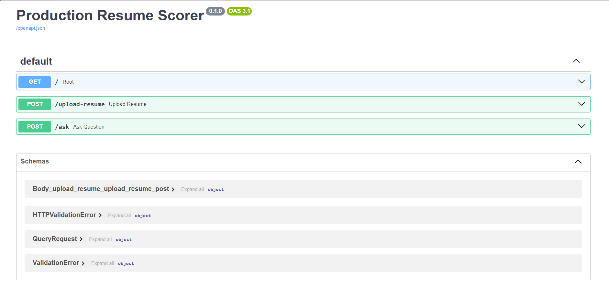

# AI Resume Scorer

A production-ready AI-powered Resume Scorer built with FastAPI that supports resume upload, semantic search, intelligent query handling, fallback mechanisms, performance logging, automated smoke testing, resume scoring, integrates LLM with fallback mechanisms for reliable responses and CI/CD pipeline using GitHub actions.

## Features
- Resume upload and text extraction
- Query-based semantic search over uploaded resume content
- Similarity score / percentage in responses
- Fallback handling for irrelevant queries
- Error handling and logging
- Request-level performance metrics (latency and memory usage)
- Automated smoke tests using pytest
- LLM-based natural language response generation
- Fallback NLP system when LLM is unavailable
- Resume scoring system (0–100)
- Performance logging and monitoring
- Automated testing with CI pipeline

## Tech Stack
- Python
- FastAPI
- Uvicorn
- Sentence Transformers
- Pytest

## Example Queries
- What skills does the candidate have?
- What is the candidate’s experience?
- Who is the candidate?


### Swagger UI



## 🏗 Architecture

- FastAPI backend handles API requests  
- Parser extracts resume text  
- Vector store performs semantic search  
- Query engine returns relevant results with similarity score  
- Fallback logic handles low-confidence queries  
- Logging middleware tracks performance metrics  
- CI pipeline ensures automated testing on every push  

## 📌 Project Summary

Developed a production-ready AI Resume Scorer using FastAPI that processes resumes, performs semantic search, and answers user queries with similarity-based results. Implemented fallback mechanisms for low-confidence queries, integrated performance logging (latency and memory usage), and built an automated CI pipeline using GitHub Actions to ensure code reliability and quality.

## 🚀 Key Highlights

- Built end-to-end AI-based resume evaluation system
- Implemented semantic search for intelligent query answering
- Integrated LLM with fallback mechanism for reliability
- Designed resume scoring system (0–100 evaluation)
- Added performance logging (latency & memory tracking)
- Implemented CI/CD pipeline using GitHub Actions
- Developed automated test suite using pytest

## 📊 Resume Scoring

Evaluate resumes with a structured scoring system:

- Score range: 0–100
- Based on:
  - Name presence
  - Skills section
  - Experience section

### Example Response

```json
{
  "resume_score": 100,
  "summary": "Strong resume with key details present.",
  "details": [
    "Name found",
    "Skills section found",
    "Experience section found"
  ]
}

---

## 🔹 Keep your Architecture section (already added)

---

## 🔹 Keep Screenshot section (already added)

---

## 🔹 FINAL ADD THIS (IMPORTANT FOR RECRUITERS)

```md
## 📌 Project Summary

Developed a production-ready AI Resume Scorer using FastAPI that processes resumes, performs semantic search, and answers queries with similarity-based results. Integrated LLM for natural language responses with a fallback mechanism to ensure reliability during API failures. Implemented resume scoring, performance monitoring, and CI/CD pipeline using GitHub Actions to maintain code quality.


## Run Locally
```bash
uvicorn main:app --host 0.0.0.0 --port 8000
